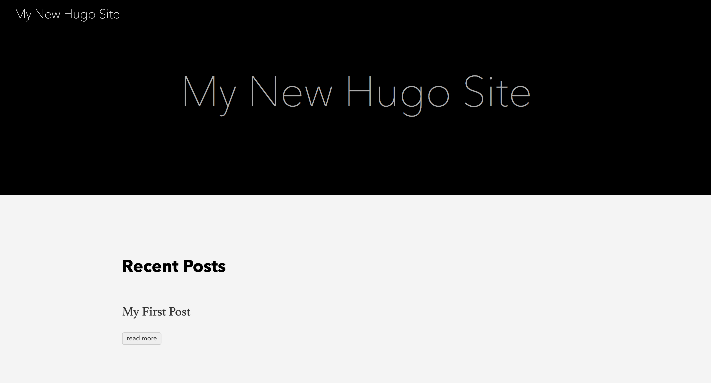

# Hugo Quickstart Sample
> A simple static site skeleton, based on Hugo's quickstart guide

This project was created based on the [Hugo quickstart guide](https://gohugo.io/getting-started/quick-start/).





## How to setup a site

These are the steps which were followed to set this project up. These steps can serve as a reference for your new or existing Hugo projects.


### Create repo

```bash
$ hugo new site quickstart
```
```
Congratulations! Your new Hugo site is created in .../quickstart.

Just a few more steps and you're ready to go:

1. Download a theme into the same-named folder.
   Choose a theme from https://themes.gohugo.io/, or
   create your own with the "hugo new theme <THEMENAME>" command.
2. Perhaps you want to add some content. You can add single files
   with "hugo new <SECTIONNAME>/<FILENAME>.<FORMAT>".
3. Start the built-in live server via "hugo server".

Visit https://gohugo.io/ for quickstart guide and full documentation.
```

```bash
cd quickstart
```

### Add a theme

Add a theme to the config.

```bash
$ echo 'theme = "ananke"' >> config.toml
```

Add the theme's repo as a Git _submodule_.

```bash
$ git submodule add https://github.com/budparr/gohugo-theme-ananke.git themes/ananke
```

This creates a [.gitmodules](.gitmodules) file and the `themes/ananke` directory and adds them both to staging. Those can then be committed.

Note that we added a subproject directory with its **own** version control, which is **not** stored by the top-level project's version control in the way that files normally are. The top-level project will keep track of which version of the submodule it needs by referencing a commit.


### Add a post

```bash
$ hugo new posts/my-first-post.md
```

### Run

Start the server, with drafts enabled.

```bash
$ hugo server -D
```
